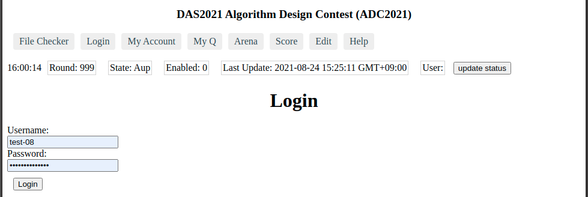
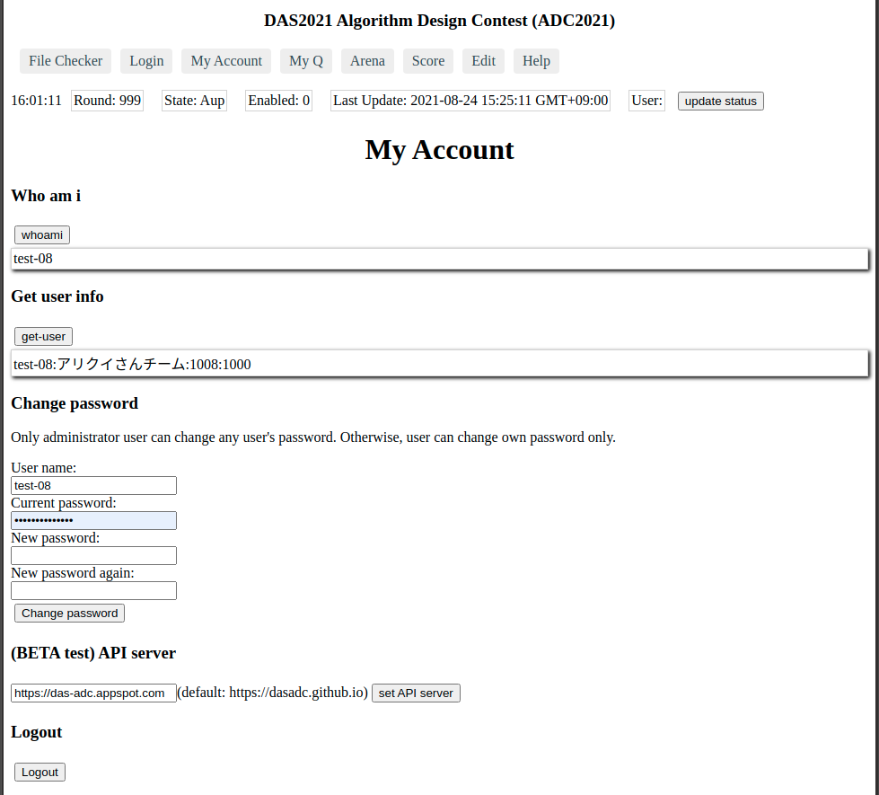
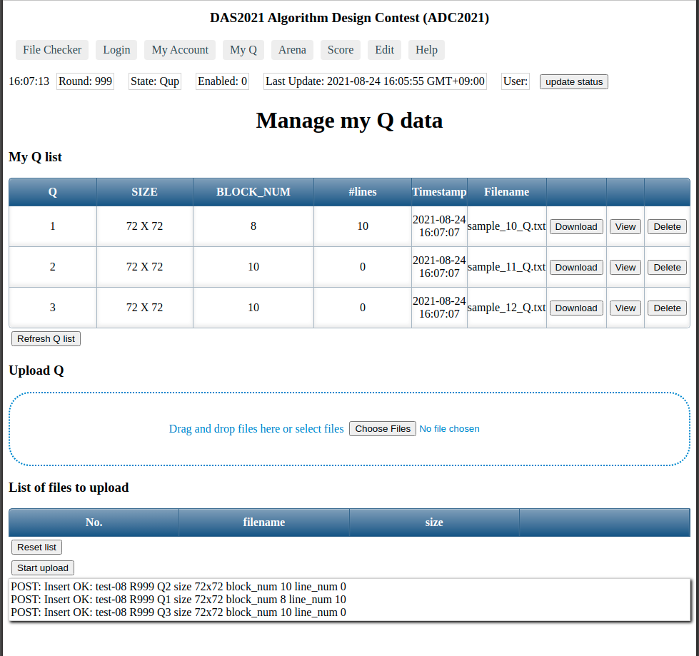
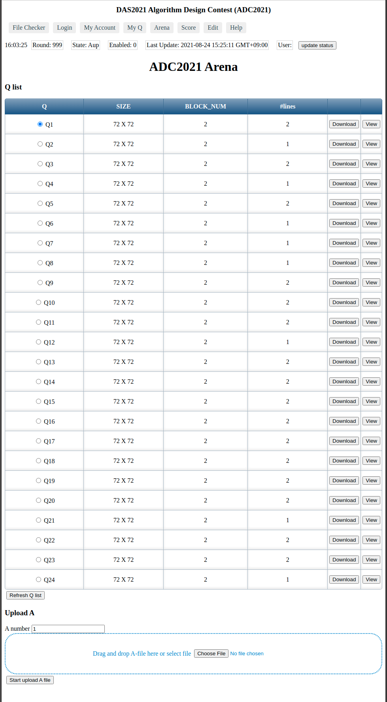
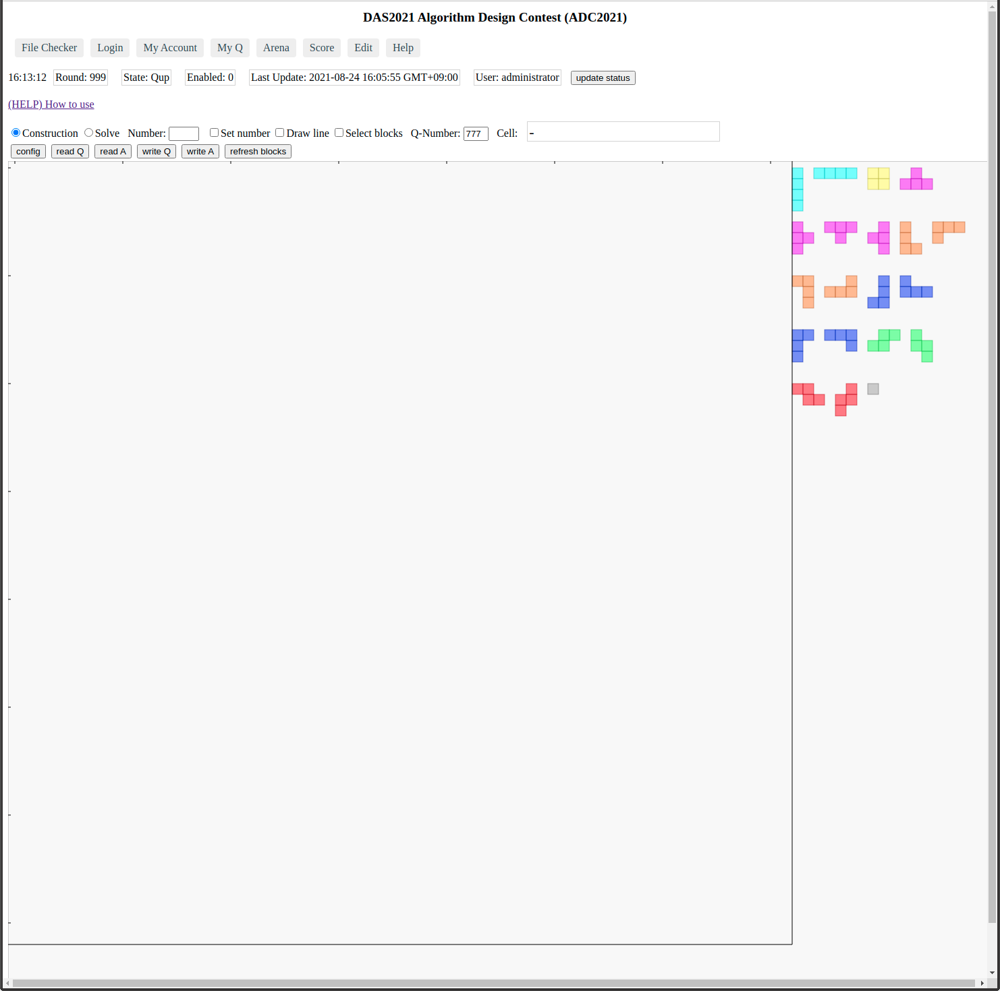
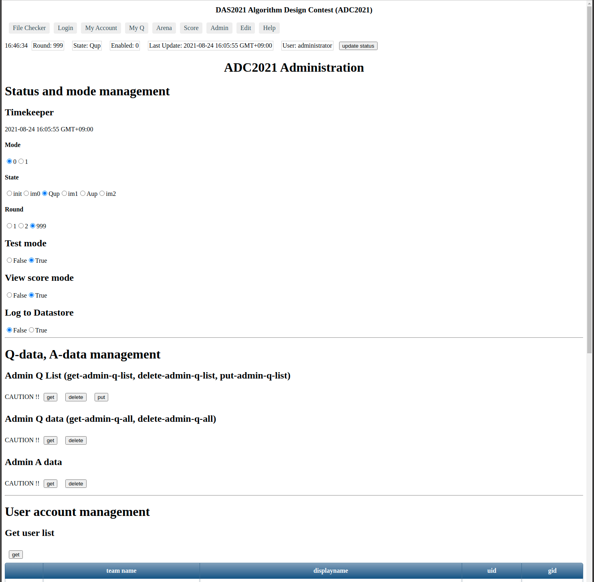

Client Application "client-app" for DA Symposium 2021, Algorithm Design Contest (ADC2021)
============================================================================

ADC2021で使うウェブアプリ"client-app"について説明する。

参加ユーザー向け情報
--------------------

### ウエブアプリclient-appのURL

2つのURLから、アクセス可能である。

1. https://das-adc.appspot.com/ が、ADC2021の公式バージョンである。
2. https://dasadc.github.io/static/app/ はおもに、後述の、問題作成＆人力回答ツールである「テトロミノ・エディタ」（"Edit"メニュー）を使うために用意している。こちらも、`https://das-adc.appspot.com/`と同じAPIサーバにアクセスするように小細工をしてあるため、おそらく、1とほぼ同じ使い方ができるはずだが、2021-08-24現在、動作テストが不十分なため、ADC2021のコンテスト本番では使用しないでほしい。

### ウェブアプリを使う

ウェブブラウザで https://das-adc.appspot.com/ にアクセスする。

動作確認しているウェブブラウザは、Chrome、Firefoxなど。

Edgeは、動作未確認である。

Internet Explorer 11は、動作未確認であり、かなり怪しい。

### 画面の構成

- "DAS2021 Algorithm Design Contest (ADC2021)"は、タイトル
- "File Checker" 〜 "Help"の部分は、画面モードを切り替えるためのメニュー。クリックすることで、画面モードが切り替わる。
- 時刻、Round、State、〜 User、"update status"の部分は、ステータス・バーである
    - 左端に、現在時刻が表示される
    - "Round"に、Roundカウンタ値が表示される。この値の意味は、999はテスト期間中、1は事前競技中、2は当日の本番競技中である。[参考](../conmgr.md#schedule)
    - "State"は、現在の状態を表示している。状態は、[init, im0, Qup, im1, Aup, im2](../conmgr.md#state)がある。状態ごとに、ユーザーが実行できる操作が決まっている。
    - "Enabled"が1のとき、[現在時刻の分の値に応じて、状態が自動遷移する](../conmgr.md#state)。
	- "Last Update"は、もっとも最近、状態遷移した時刻である。
	- "User"は、現在ログイン中のユーザー名が表示される。
	- "update status"ボタンは、ステータス・バーの表示を強制的に更新させたいときに、クリックする。
- ステータスバーより下の領域に、メニューで選択した画面モードごとの表示が行われる。
	

### File Checker

ADC参加チームは、最大3問まで、問題を自作して当日提供できるが、その問題データの書式が正しいかを、File Checkerで確認できる。

ウェブアプリの、画面上のほうにメニューが表示されている。その中にある、"File Checker"メニューをクリックする。

File Checkerは、ログインせずに使うことができる。

File Checker画面にて、問題データ(Q-file)と正解データ(A-file)の2つを指定する。

"Check files"ボタンをクリックすると、チェック結果が表示される。

チェック結果の読み方は、[adc2019.pyのドキュメント](../server/adc2019.md)を参照してほしい。

### "Login" (ログインする、ログアウトする)

ウェブアプリの、画面上のほうにメニューが表示されている。その中にある、"Login"メニューをクリックする。

Username、Passwordに、事前に通知されたユーザー名とパスワードを入力し、Loginボタンをクリックする。

ログイン完了後は、メニューバーの下にあるステータスラインに、`User: xxxxxx`のようにユーザー名が表示される。

### "My Account" (アカウント設定)

- "whoami"ボタンをクリックすると、ユーザー名が表示される。ログインできているか動作確認用のための機能である。
- "get-user"ボタンをクリックすると、ユーザー情報 `ユーザー名:説明:uid:gid` が表示される。同じく、動作確認用。
- Change passwordのフォームに必要事項を入力することで、パスワードを変更できる
- (betaテスト中)"API server"に、APIサーバのURLを指定する。2021-08-24時点で、ユーザーがここを変更する必要はない
- "Logout"ボタンで、ログアウトできる

### "My Q" (自作問題の管理)

ここから、自作の問題データをアップロードするなどの操作ができる。

**(注意)** 本番コンテスト開始前の**動作テスト期間中**は、本番用の自作問題データをアップロードしないでください。他のユーザーに公開されてしまいます。

#### "My Q list"

"My Q list"の表には、すでにアップロード済みの問題データが表示されている。

- "Download"ボタンで、ファイルとしてダウンロードできる
- "View"ボタンで、ウェブブラウザ上で内容を表示できる
- "Delete"ボタンで、その問題データを削除できる

#### "Upload Q"

ここで、自作問題データをアップロードできる。

(注意) すでにアップロード済みのファイルがある場合は、それらをすべて削除してから（上記の"Delete"ボタン）、まっさらな状態に戻してから、アップロードすること。

点線の四角の領域にファイルをドラッグアンドドロップするか（色が変わってから、マウスボタンを離すこと）、"Browse"ボタンをクリックして、ダイアログでファイルを選択する。

すると、"List of files to upload"の表の、アップロード対象のファイルが一覧表示される。この時点では、まだアップロードされていない。つづけて、さらにファイルを選択することも可能である。

一度の複数のファイルをアップロードできるが、ADC参加者は、アップロードできるのは3個までである。4個めからは、エラーになる。管理者（administratorユーザー）は、何個でもアップロードできる。

### "Arena" (コンテストで対戦実施中の画面)

#### "Q list"

対戦が開始されると("State"に"Aup"と表示されているとき)、表形式で、出題されたQデータが表示される。

- 表が表示されないときは、"Refresh Q list"をクリックする
- "Download"ボタンは、ファイルとしてダウンロードする
- "View"ボタンは、ブラウザ上で表示する

#### "Upload A"

回答データ(Aファイル)をアップロードする。

1. "A number"テキストボックスに、問題番号を入力する
2. 点線の四角の領域に、回答Aファイルをドラッグアンドドロップするか（色が変わってから、マウスボタンを離すこと）、"Browse"ボタンをクリックして、ダイアログで回答Aファイルを選択する
3. "Start upload A file"ボタンをクリックする
    - "A number"で指定した問題番号と、Aファイルにかかれている問題番号が一致しないときは、エラーになるので、どちらかを修正してからアップロードすればよい。※ 問題番号を間違えて回答すると不正解になってしまうため（1問につき、回答できるのは1回だけ）、それを防止するための機能

### "Score" (スコア表示)

#### "teams"の表

全チームの情報が表示される。

#### "Score board (total)"、"OK point"、"Quality point"、"Bonus point"

- 対戦中、全チームのスコアが表示される
- 運営側のコントロールによって、スコアを非表示にできる

#### Viewer (管理者専用)

- 回答データを表示する

### "Admin" (管理者向け機能)

一般ユーザーでも、なにかしら表示されているが、実際には何も操作できない。すべてエラーになる。

### "Edit" テトロミノ・エディタ（開発途上バージョン）

#### ラジオボタンの意味

- Construction = 問題作成モード
- Solve = 問題を解くモード

#### Construction, Solve 両モード共通

- 問題データ(Q)を読み込む
    - "read Q"ボタンをクリックして、
	- Qファイルを指定し、
	- "OK, use this file"ボタンをclickします。
	- ボードの欄外に、問題データのブロックが置かれます。
- 問題データ(Q)と回答データ(A)を読み込む
    - "read Q"ボタンと"read A"ボタンをそれぞれクリックして、
	- Qファイルを指定し、
	- Aファイルを指定し、
	- Aファイルの下のほうの"OK, use this file"ボタンをclickします（Qファイル側の同じ名前のボタンは違う >> バグというか、仕様が未定）。
	- Aファイル中に指定された位置で、ブロックが配置され、配線されます。
- ブロックを選択する
    - Set numberチェックボックスをoffにしてから、
	- ブロックをclickします。
	- Shift + clickで、追加選択です。
    - ドラッグで範囲選択してブロックを選択できます。"Select blocks"チェックボックスをonにしてから、ドラッグしてください。
- ブロックを移動する
    - ブロックをdragしてください。
- 数字のラインを引く
    - まず、Draw lineチェックボックスをonにして、
	- Numberに数字を入力してから、
	- ボードの空きセルをclickしてください。
- ボードの欄外のブロックを再配置する
    - "refresh blocks"ボタンをclickするか、
	- ウインドウをリサイズしたとき、再配置されます
- ブロックや、数字のラインのセルを削除する
    - 選択してから、Deleteキーを押してください
	- Solveモードでは、ブロックは削除できません

#### Constructionモード (問題データ作成)

- ctrl + dragで、ブロックが複製されます。
    - ボードの欄外にあるテトロミノは、問題作成時の、部品となるブロックなので、これらを複製して、問題を作成してください。
- configボタンをクリックして、ボードのサイズを変更できます。
- ブロックのセルに数字をセットする
    - まず、Set numberチェックボックスをonにして、
	- Numberに数字を入力してから、
	- ブロック内のセルをclickしてください。
- ブロックのセルの数字を変更する
    - 変更後の数字をNumberに入力してから、
	- セルをclickしてください。
- ブロックのセルの数字を削除する
    - Numberを空欄にしてから、
	- clickしてください。

管理者向け情報 "Admin"メニュー
--------------

### 管理者としてログインする

管理者のユーザーアカウント(`../server/adcusers_in.yaml`、`../server/adcusers.py`で記述された`uid`が`0`のユーザー)でログインする。

これで、管理者のみに許されたウェブアプリの機能(おもに"Admin"メニューにある)が利用できるようになる。

~~(注意) 一般ユーザーにもAdminメニューが表示されてしまうが、一般ユーザーが実行すると常にエラーになる。~~

管理者の業務はADC運営にとってクリティカルな処理を伴うので、フェイルセーフのために、ボタンをクリックする際には、Shift、Ctrl、Altキー(modifier key)などを押しながら、ボタンをクリックするようにしているところがある。どのキーを押すのかは、マウスポインタをボタン上へhoverさせたとき、tool tipsとして表示される。こうしたため、タブレットなどタッチデバイスでは、操作ができなくなってしまった。

<a name="adcusers"><a>
### ユーザー登録ファイルについて

- `adcusers_in.yaml`
    - 現在推奨されるファイル形式。
	- パスワードは平文で記述する
    - `adcusers_gen.py`の入力ファイルである
- `adcusers_in.py`
    - 2019年まで使われていた、旧方式のファイル形式。
	- パスワードは平文で記述する
    - `adcusers_gen.py`の入力ファイルである。`adcusers_in.yaml`が存在しないときに使われる
- `adcusers.py`
    - `adcusers_gen.py`を実行すると生成されるファイル。
	- administratorユーザーのみが記述されている
	- パスワードはハッシュである
- `adcusers.yaml`
    - `adcusers_gen.py`を実行すると生成されるファイル。
	- `adcusers_in.yaml`(もしくは`adcusers_in.py`)で記述されていた、全ユーザーが記述されている
	- パスワードは平文である。API serverがパスワードをハッシュ化して、Datastoreに登録する

### ユーザーを登録する

従来、コマンドライン環境でコマンド`adccli create-users adcusers_in.py`を実行してユーザー登録をしていたが、2020年バージョンから、ウェブアプリでユーザー登録ができるようになっている。

1. YAML形式のファイル`adcusers_in.yaml`にアカウント情報を書く。参考用のファイル[`adc2019/server/adcusers_in.sample.yaml`](../server/adcusers_in.sample.yaml)がある
    - `password`は平文で記述する。
2. ディレクトリ`adc2019/server/`にて、コマンド`python adcusers_gen.py`を実行すると、2つのファイル`adcusers.py`と`adcusers.yaml`が生成される
    - `adcusers.py`には、管理者ユーザーのみが記述されていて、データストア内に登録されたアカウント情報に関係なく、固定登録のアカウントとして利用できる。
	- `adcusers.py`に記述されている`password`は、ハッシュ値である
	- `adcusers.py`はサーバー(`adc2019/server`)が起動時に参照するファイルのため、現在実行中のサーバーには、反映されない。たとえばGoogle App Engineで実行中のサーバーの場合は、反映させるにはdeployしなおす必要がある
3. ウェブブラウザでウェブアプリclient-appにアクセスする
4. ウェブアプリの"Admin"メニューにある、"Create users (Upload adcusers.yaml)"にて、2で作成したYAMLファイル`adcusers.yaml`を選択するか、ファイルをドラッグ&ドロップする。
5. "Start upload"ボタンをクリックする。問題なければ、これでユーザーアカウントが作成される
6. この時点では、画面表示が更新されていない場合は、"Get user list"の下にある"get"ボタンをクリックする。これで、現在登録されている全ユーザーが表示される

### ユーザーを削除する

1. "Admin"メニューをクリックし、Admin画面に移動する。
2. "User account management"の下に、ユーザー名の一覧リストが表示されているので、削除したいユーザーの左端にあるチェックボックスをオンにする。
3. Altキー、Ctrlキー、Shiftキーを押しながら"delete users"ボタンをクリックする。

(注意) ユーザー"administrator"が2つ表示されていることがあるが、2つとも削除しても構わない。削除しても、必ず1つは残る(`adcusers.py`にて登録されている固定ユーザーは、削除できないため)。

### Timekeeper

- TimekeeperのModeは、時刻の分の値に応じて、自動的に状態遷移をする/しないを制御する。コンテスト本番中は、0にする
- TimekeeperのStateでは、強制的に、状態遷移させる
- TimekeeperのRoundでは、Roundカウンタ値を変更できる。この値の意味は、999はテスト期間中、1は事前競技中、2は当日の本番競技中である。[参考](../conmgr.md#schedule)。QデータとAデータは、Roundカウンタの値ごとに、個別に管理されているので、Roundカウンタを変更すると、Qデータ、Aデータ、スコアの表示が切り替わる。
- Test modeは、Trueのとき、Aデータをファイルとしてダウンロード可能になる、など
- View score modeは、Trueのとき、"Score"画面でスコアが表示される。対戦中、前半ではTrueにしておいて、後半に入ったらFalseにするのがよい
- Log to Datastoreは、2021-08-24現在、Falseにしておくことを推奨する。Trueにすると、アクセスログが、Datastoreに保存される。

### Q-data, A-data management

- Admin Q Listは、出題問題リストを、表示(get)、削除(delete)、作成(put)する。
    - 作成する前に、deleteが必要である。対戦開始前の、状態"im1"のときに、deleteして、putすればよい
	- getで、問題番号ごとに、出題者と、その出題者の何番目の問題か、を確認できる
- Admin Q dataは、出題問題リストの情報を表示する
- Admin A dataは、回答データの概要を表示する
- "User account management"では、ユーザーアカウントの登録と削除ができる（前述のとおり）

### User account management

- 現在登録されているアカウントが表示されていて、[アカウントを削除できる](#delete-user)
- YAMLファイルから、[アカウント登録ができる](#create-users)
    - [ユーザー登録ファイルについて](#adcusers)

****
以下、Angularで自動生成されたドキュメント。念のためのメモとして残しておく。
****

# client-app

This project was generated with [Angular CLI](https://github.com/angular/angular-cli) version 8.2.0.

## Development server

Run `ng serve` for a dev server. Navigate to `http://localhost:4200/`. The app will automatically reload if you change any of the source files.

## Code scaffolding

Run `ng generate component component-name` to generate a new component. You can also use `ng generate directive|pipe|service|class|guard|interface|enum|module`.

## Build

Run `ng build` to build the project. The build artifacts will be stored in the `dist/` directory. Use the `--prod` flag for a production build.

## Running unit tests

Run `ng test` to execute the unit tests via [Karma](https://karma-runner.github.io).

## Running end-to-end tests

Run `ng e2e` to execute the end-to-end tests via [Protractor](http://www.protractortest.org/).

## Further help

To get more help on the Angular CLI use `ng help` or go check out the [Angular CLI README](https://github.com/angular/angular-cli/blob/master/README.md).
